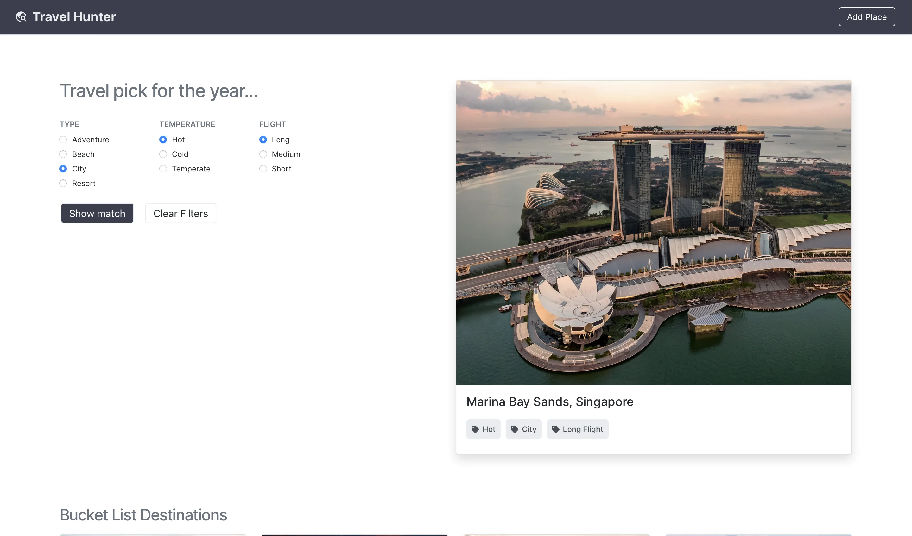

# Travel Hunter



This is a [Next.js](https://nextjs.org/) project bootstrapped with [`create-next-app`](https://github.com/vercel/next.js/tree/canary/packages/create-next-app) for picking travel destinations.

## Built With

- Next.js
- React
- FireBase
- Styled Components

## Getting Started

- Clone the project by running: `git clone https://github.com/george-swift/travel-hunter.git`

- Next, install dependencies by running: `npm install`

- Then, run the development server:

```bash
npm run dev
# or
yarn dev
```

- Open [http://localhost:3000](http://localhost:3000) with your browser to see the result.

- You can start editing the page by modifying `pages/index.js`. The page auto-updates as you edit the file.

## Learn More

To learn more about Next.js, take a look at the following resources:

- [Next.js Documentation](https://nextjs.org/docs) - learn about Next.js features and API.
- [Learn Next.js](https://nextjs.org/learn) - an interactive Next.js tutorial.
- [The Next.js GitHub repository](https://github.com/vercel/next.js/) - for feedback and contributions.
- [Next.js deployment documentation](https://nextjs.org/docs/deployment) for details on deployment.

## Acknowledgements

- [Photocredits](https://unsplash.com)
- [Inspiration](https://brittanychiang.com/)
