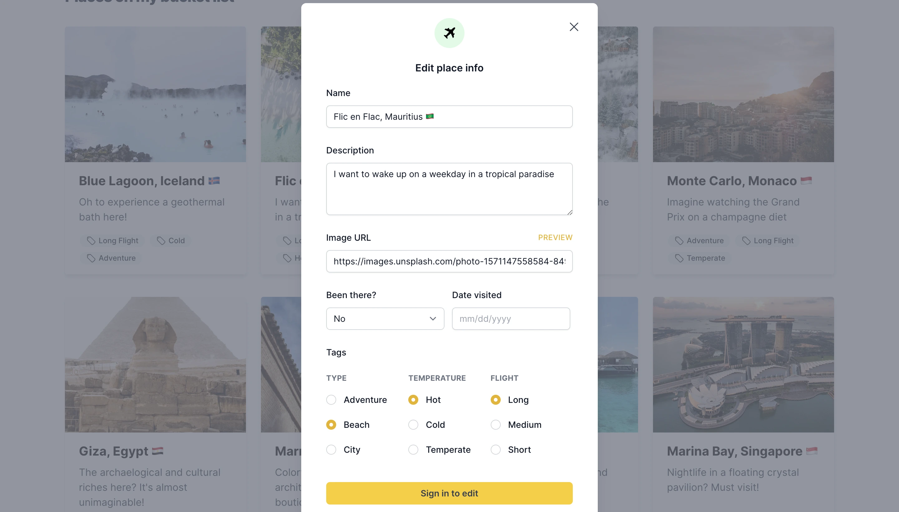

# My Travel Planner



This is a [Next.js](https://nextjs.org/) project bootstrapped with [`create-next-app`](https://github.com/vercel/next.js/tree/canary/packages/create-next-app) for curating travel destinations.

## Live Link

[Click here to visit](https://my-travel-planner.vercel.app/)

## Built With

- Next.js 13
- Firebase
- TypeScript
- Tailwind CSS

## Getting Started

- Clone the project by running: `git clone https://github.com/george-swift/my-travel-planner.git`

- Install dependencies by running: `npm install`. Note that this project requires Node v16.x and above

- Next, run the development server:

```bash
npm run dev
# or
yarn dev
```

- Open [http://localhost:3000](http://localhost:3000) with your browser to see the result.

- You can start editing the page by modifying `app/page.tsx`. The page auto-updates as you edit the file.

- This project uses [`next/font`](https://nextjs.org/docs/basic-features/font-optimization) to automatically optimize and load Inter, a custom Google Font.

## Learn More

To learn more about Next.js, take a look at the following resources:

- [Next.js Documentation](https://nextjs.org/docs) - learn about Next.js features and API.
- [Learn Next.js](https://nextjs.org/learn) - an interactive Next.js tutorial.

You can check out [the Next.js GitHub repository](https://github.com/vercel/next.js/) - your feedback and contributions are welcome!

- [Next.js deployment documentation](https://nextjs.org/docs/deployment) for details on deployment.

## Acknowledgements

Photo credit:

- Hero image by [Weston M](https://unsplash.com/pt-br/@betteratf8?utm_source=unsplash&utm_medium=referral&utm_content=creditCopyText) on [Unsplash](https://unsplash.com/photos/oiBOjhQb2Ao?utm_source=unsplash&utm_medium=referral&utm_content=creditCopyText)
- [Places in bucket list](https://unsplash.com)

[Project Inspiration](https://time-to-have-more-fun.now.sh/)
